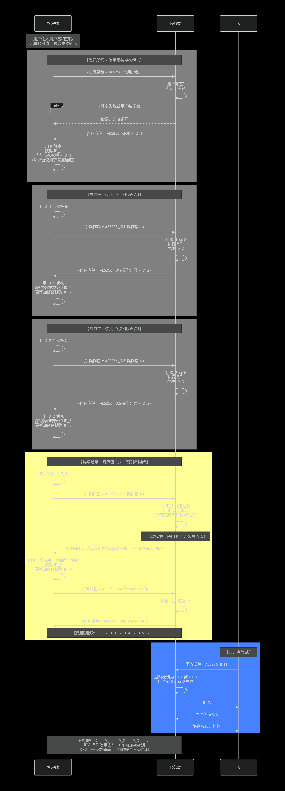

# CHAP-IEM 技术文档

> **注意：本协议并非旧版的 Challenge-Handshake Authentication Protocol（挑战握手认证协议）。** 这是一个名称相似但完全不同的协议家族。CHAP-IEM 是 Chain Hash Authentication Protocol 的衍生变体。

---

## 一、概述

CHAP-IEM（ID Encryption Mode）是标准 CHAP 协议的一个衍生变体。两者的核心区别在于：标准 CHAP 始终使用预共享密钥（用户密码哈希）进行加密，而 CHAP-IEM 在登录完成后切换到以 ID 作为加密密钥的链式模式。

---

## 二、与标准 CHAP 的核心差异

| 对比维度 | 标准 CHAP | CHAP-IEM |
|---------|---------|----------|
| 加密密钥 | 始终使用预共享密钥 K | 登录阶段使用 K，之后切换为当前 ID |
| ID 的用途 | 仅作为会话标识 | 同时作为会话标识和加密密钥 |
| 密钥更新 | 密钥 K 固定不变 | 密钥随 ID 链式变化 |
| 异常恢复 | 服务端用 K 推送当前 ID 完成同步 | 需重新登录建立新密钥链 |

---

## 三、CHAP-IEM 流程详解

### 3.1 登录阶段（与标准 CHAP 相同）

客户端输入用户名和密钥，将密钥转换为哈希值作为预共享密钥 K。客户端使用 K 对用户名进行 AES 加密，发送给服务端。

服务端使用预配置的密钥 K 解密，验证用户名有效性。验证成功后，服务端生成 ID_1，将操作结果 OK 与 ID_1 打包，使用 K 加密后返回给客户端。

客户端使用 K 解密，获得 ID_1。此时客户端持有 K 和 ID_1，但后续操作将不再使用 K。

### 3.2 正常操作流程

**第一次操作**

客户端使用 ID_1 作为加密密钥，对操作指令进行 AES 加密，发送给服务端。

服务端使用 ID_1 解密（因为 ID_1 是服务端上次生成并下发的），成功解密后执行操作，同时生成新的 ID_2。服务端使用 ID_1（旧 ID）加密操作结果及 ID_2，返回给客户端。

客户端用 ID_1 解密，获得操作结果和 ID_2，然后将当前加密密钥更新为 ID_2。

**第二次操作**

客户端使用 ID_2 加密操作指令。服务端用 ID_2 解密，执行操作后生成 ID_3，再用 ID_2 加密返回。客户端更新密钥为 ID_3。

以此类推，形成密钥链：登录用 K → ID_1 → ID_2 → ID_3 → ...

### 3.3 关键设计要点

每次响应包中，服务端使用**旧 ID** 加密新 ID 返回给客户端。这意味着：

- 只有持有当前有效 ID 的客户端才能解密获得下一个 ID
- 服务端不需要额外存储新 ID 的加密密钥，旧 ID 天然就是加密新 ID 的最佳载体
- 加密密钥随每次操作自然更新，无需额外协商

### 3.4 异常恢复机制

当响应包丢失时，客户端本地密钥仍为 ID_3，但服务端当前有效密钥已更新为 ID_4。

客户端使用 ID_3 加密新操作并发送。服务端使用 ID_3 解密成功（因为 ID_3 确实是上次下发的），但发现 ID_3 已失效——服务端期望收到的是用 ID_3 加密的确认或后续操作，但此时 ID_3 对应的操作窗口已关闭，服务端已进入 ID_4 状态。

由于服务端不再持有 ID_3 作为有效密钥（ID_3 已被销毁），无法用 ID_3 加密任何返回信息。服务端只能返回特殊指令，要求客户端重新走完整的登录流程。

客户端重新登录，获得新的 K 和新的 ID_1'，重新开始密钥链。

**与标准 CHAP 的对比**：标准 CHAP 中服务端始终持有固定密钥 K，因此可以将当前有效 ID 加密后推送给客户端完成同步，无需重新登录。CHAP-IEM 中密钥随 ID 变化，服务端无法用已销毁的旧密钥加密信息，只能强制重新登录。

---

## 四、安全分析

### 4.1 攻击者视角

**窃听攻击**：攻击者截获任意密文包。由于每次操作后加密密钥立即更换，且密钥派生路径不可逆（已知 ID_2 无法反推 ID_1），攻击者无法从单个包中获取有效信息。

**重放攻击**：攻击者重放旧的加密包。服务端当前有效密钥已更新，使用新密钥解密旧包必然失败，重放攻击无效。

**伪造攻击**：攻击者发送任意伪造密文，服务端解密失败，直接拒绝。

### 4.2 与标准 CHAP 的安全对比

| 安全特性 | 标准 CHAP | CHAP-IEM |
|---------|---------|----------|
| 密钥固定性 | K 固定，长期有效 | 密钥持续更换 |
| 单包破解影响 | 可解密所有后续通信 | 仅影响当前单包 |
| 前向安全性 | 不支持（K 泄露则全量泄露） | 支持（旧密钥无法推导新密钥） |
| 同步机制安全性 | 服务端可主动推送同步 | 无主动同步能力 |

### 4.3 局限性

密钥不同步时必须重新登录，导致状态中断。登录阶段的预共享密钥 K 若被泄露，攻击者可完成初始认证并获得 ID_1，但由于 K 仅用于登录，后续通信仍受 ID 链保护。

---

## 五、适用场景

CHAP-IEM 适合以下场景：

1. 对前向安全性有要求的通信环境
2. 单次会话生命周期较短的应用
3. 可容忍重新登录开销的系统
4. 需要降低长期密钥暴露风险的高安全场景

不适用的场景：

1. 网络质量较差、丢包率高的环境（频繁重新登录）
2. 需要长时间保持单一会话的业务
3. 无法接受连接中断的关键系统

---

## 六、总结

CHAP-IEM 在标准 CHAP 的登录流程基础上，引入了 ID 即密钥的设计理念。登录阶段仍使用预共享密钥 K 完成身份认证和 ID_1 分发，之后切换到以 ID 为密钥的链式加密模式。这一设计牺牲了异常自动恢复的能力，换取了每次操作后密钥自动更新的前向安全性。标准 CHAP 与 CHAP-IEM 的选择，本质上是连接连续性与前向安全性之间的权衡。
