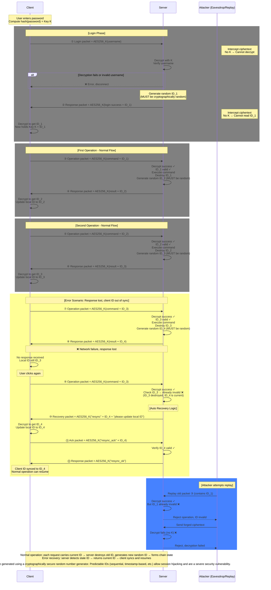
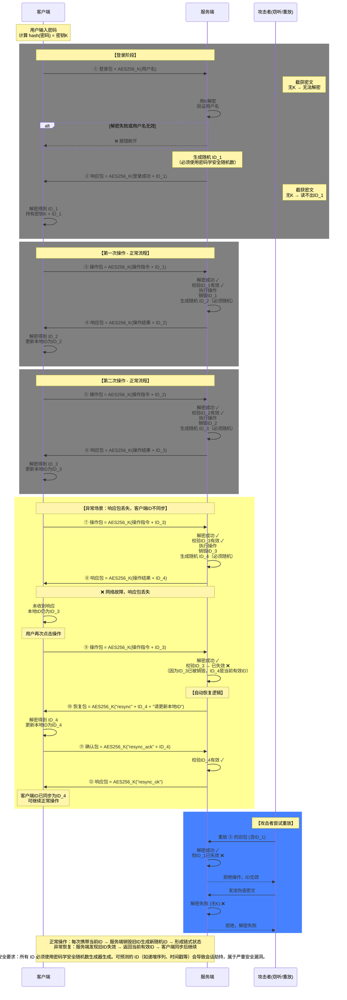
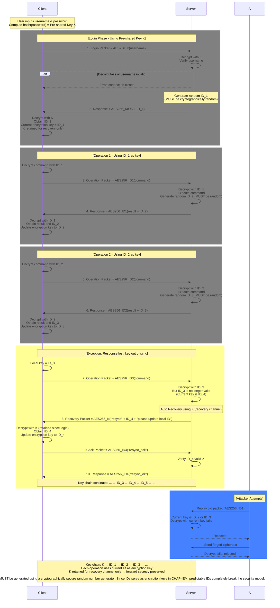
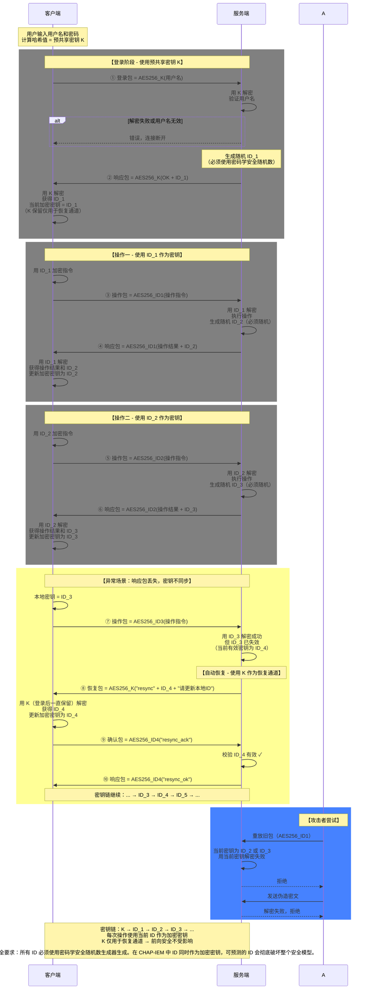
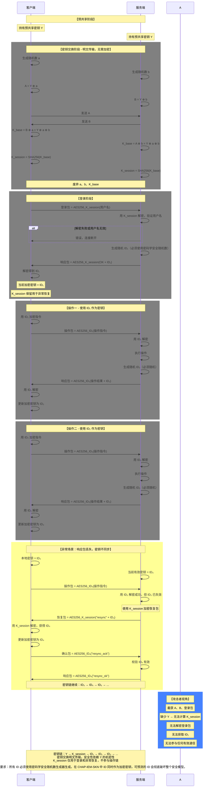

# Flowchart-code.md

**这个文档是专门给非识图AI看的，如果你是人那你可以忽略了**

**This document is specifically intended for AI that does not perform image recognition. If you are a human, you can ignore it.**

---

## CHAP

---

## CHAP-zh

---

## CHAP-IEM

---

## CHAP-IEM-zh

---

## CHAP-IEM-SKN

```mermaid
sequenceDiagram
    participant C as Client
    participant S as Server

    Note over C,S: [Pre-shared Phase]
    Note over C: Holds pre-shared key Y
    Note over S: Holds pre-shared key Y

    rect rgb(128, 128, 128)
        Note over C,S: [Key Exchange Phase - Plaintext, No Encryption Required]
        C->>C: Generate random a
        S->>S: Generate random b
        C->>C: A = Y ⊕ a
        S->>S: B = Y ⊕ b
        C->>S: Send A
        S->>C: Send B
        C->>C: K_base = B ⊕ a = Y ⊕ a ⊕ b
        S->>S: K_base = A ⊕ b = Y ⊕ a ⊕ b
        C->>C: K_session = SHA256(K_base)
        S->>S: K_session = SHA256(K_base)
        Note over C,S: Discard a, b, K_base
    end

    rect rgb(128, 128, 128)
        Note over C,S: [Login Phase]
        C->>S: Login Packet = AES256_K_session(username)
        S->>S: Decrypt with K_session, verify username
        alt Decrypt fails or username invalid
            S-->>C: Error, connection closed
        end
        S->>S: Generate random ID₁ (MUST be cryptographically random)
        S->>C: Response Packet = AES256_K_session(OK + ID₁)
        C->>C: Decrypt to obtain ID₁
        Note over C: Current encryption key = ID₁
        Note over C: K_session retained for exception recovery
    end

    rect rgb(128, 128, 128)
        Note over C,S: [Operation 1 - Using ID₁ as key]
        C->>C: Encrypt command with ID₁
        C->>S: Operation Packet = AES256_ID₁(command)
        S->>S: Decrypt with ID₁
        S->>S: Execute command
        S->>S: Generate random ID₂ (MUST be random)
        S->>C: Response Packet = AES256_ID₁(result + ID₂)
        C->>C: Decrypt with ID₁
        C->>C: Update encryption key to ID₂
    end

    rect rgb(128, 128, 128)
        Note over C,S: [Operation 2 - Using ID₂ as key]
        C->>C: Encrypt command with ID₂
        C->>S: Operation Packet = AES256_ID₂(command)
        S->>S: Decrypt with ID₂
        S->>S: Execute command
        S->>S: Generate random ID₃ (MUST be random)
        S->>C: Response Packet = AES256_ID₂(result + ID₃)
        C->>C: Decrypt with ID₂
        C->>C: Update encryption key to ID₃
    end

    rect rgb(255, 255, 150)
        Note over C,S: [Exception: Response lost, key out of sync]
        C->>C: Local key = ID₃
        S->>S: Current valid key = ID₄
        C->>S: Operation Packet = AES256_ID₃(command)
        S->>S: Decrypt with ID₃ succeeds, but ID₃ is invalid
        Note over S: Use K_session for recovery packet
        S->>C: Recovery Packet = AES256_K_session("resync" + ID₄)
        C->>C: Decrypt with K_session, obtain ID₄
        C->>C: Update encryption key to ID₄
        C->>S: Ack Packet = AES256_ID₄("resync_ack")
        S->>S: Verify ID₄ valid
        S->>C: Response Packet = AES256_ID₄("resync_ok")
        Note over C,S: Key chain continues: ID₃ → ID₄ → ID₅ → ...
    end

    rect rgb(70, 130, 255)
        Note over A: [Attacker Perspective]
        Note over A: Intercepts A, B, Login Packet
        Note over A: Lacks Y → Cannot compute K_session
        Note over A: Cannot decrypt Login Packet
        Note over A: Cannot obtain ID₁
        Note over A: Cannot participate in any valid communication
    end

    Note over C,S: Key chain: Y → K_session → ID₁ → ID₂ → ID₃ → ...<br/>Key exchange transmitted in plaintext, security depends on confidentiality of Y<br/>K_session used only for login and exception recovery, not for operation chain<br/><br/>⚠️ CRITICAL: All IDs MUST be generated using a cryptographically secure random number generator. Since IDs serve as encryption keys in CHAP-IEM-SKN, predictable IDs completely break the security model.
```

---

## CHAP-IEM-SKN-zh

---

## Summary of Changes

| Location | Change |
|----------|--------|
| Login Phase (all diagrams) | Added note: "Generate random ID_1 (MUST be cryptographically random)" |
| Each operation (all diagrams) | Added note: "Generate random ID_n (MUST be random)" |
| Footer note (CHAP) | Added critical warning about predictable IDs leading to session hijacking |
| Footer note (CHAP-IEM) | Added critical warning that predictable IDs completely break security model |
| Footer note (CHAP-IEM-SKN) | Added critical warning that predictable IDs completely break security model |
| CHAP-IEM-SKN (English) | Full flow diagram including key exchange, login, operations, and exception recovery |
| CHAP-IEM-SKN-zh (Chinese) | Full flow diagram including key exchange, login, operations, and exception recovery |
